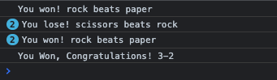
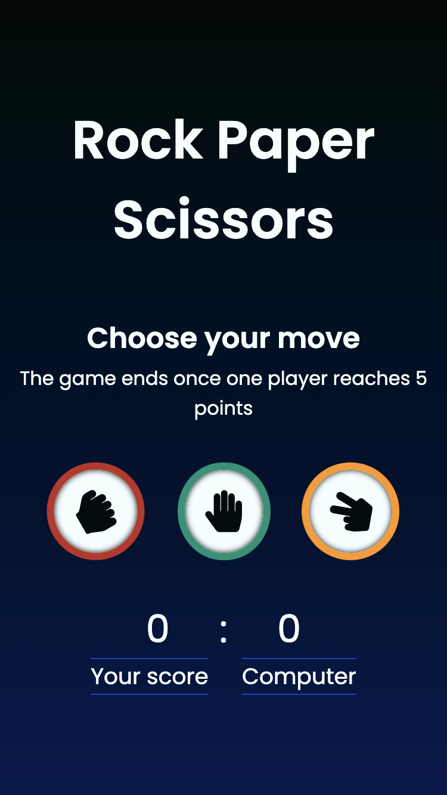

## The Odin Project 

### The project: Rock Paper Scissors 

The aim of this project is to create a simple rock-paper-scissors game to improve JavaScript skills. And to learn features like branch and merge in GitHub and use the GitHub effectively.

This project, which is included in Foundation curriculum of The Odin Project, consists of two stages.

1. Playing the game completely on the browser console by using prompt method to get input from the user.

2. Adding UI by creating a branch. 
   Playing the game by clicking on buttons.

#### Rules of the Game

- :hand: beats :fist:
- :v: beats :hand:
- :fist: beats :v:

#### Building Rock-paper-scissors game on console using JavaScript:

1. Created a function called `computerPlay` that randomly returns either ‘Rock’, ‘Paper’ or ‘Scissors’ because the game is going to play against the computer. 
2. Created a function that plays a single round of Rock Paper Scissors with two parameters - the `playerSelection` and `computerSelection`. 
3. Created a function called `gameWinner` that keeps score and reports a winner or loser of the round. 
4. Created a new function called `game`. Used the `playRound`, `computerPlay`, `gameWinner` functions inside of this function. And declared the playerSelection variable that uses `prompt` to get input from the user and made it case-insensitive.   
5. Created a function called `finalWinner` to display the winner at the end of the game.
6. Created a function called `startGame` and used a `for` loop to play the game for 5 rounds. And called the `game` and `finalWinner` functions inside of this function.  

#### Rock-paper-scissors game played with buttons using JavaScript:

1. Removed the logic that plays exactly five rounds.
2. Removed the `prompt` that gets input from the user and created three buttons. Added an event listener to the buttons that calls the `game` function every time a button is clicked. 
3. Added the "selection_panel" and "game_result" divs for displaying results and changed all of the `console.log`s into DOM methods.
4. Displayed the running score, and announced a winner of the game once one player reaches 5 points. Added a button to restart the game.
5. Added a button to start the game.
6. Learned creating a feature branch and making the changes to the new branch. 

Live preview is [here](https://cansubaydar.github.io/rock-paper-scissors/)